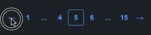

# vue-mzc-pagination
Simple Vue2 pagination component



[Online demo](https://jsfiddle.net/)

## Installation
```sh
npm install vue-mzc-pagination --save
```

## Usage
```js
import VueMzcPagination from "vue-mzc-pagination";
// styles (optional)
import "vue-mzc-pagination/dist/vue-mzc-pagination.css"

export default {
  components: {
    VueMzcPagination,
  },
  data() {
    return {
      page: 1,
      count: 15,
    };
  },
};
```
```html
<vue-mzc-pagination
  :current="page"
  :count="count"
  @change="(p) => (page = p)"
>
</vue-mzc-pagination>
```

## Slots
```html
<vue-mzc-pagination>
  <template v-slot:prev>prev</template>
  <template v-slot:next>next</template>
</vue-mzc-pagination>
```

## Customizing
class is the specified props "base-class", default: "vue-mzc-pagination"
```html
<vue-mzc-pagination base-class="custom"></vue-mzc-pagination>
```
Output HTML:
```html
<div class="custom">
  <span class="custom__item">
    <button class="custom__button custom__button--prev custom__button--disable"> ← </button>
  </span>
  <span class="custom__item">
    <button class="custom__button custom__button--active"> 1 </button>
  </span>
  <span class="custom__item">
    <button class="custom__button"> 2 </button>
  </span>
  <span class="custom__item">
    <button class="custom__button custom__button--spred"> ... </button>
  </span>
  <span class="custom__item">
    <button class="custom__button"> 15 </button>
  </span>
  <span class="custom__item">
    <button class="custom__button custom__button--next"> → </button>
  </span>
</div>
```

## Offset
You can specify the number of pages left and right, default: 1
```html
<!--offset 0-->
<vue-mzc-pagination
  :offset="0"
  :page="5"
  :count="10"
>
</vue-mzc-pagination>
<!--output-->
<- 1 ... [5] ... 10 ->

<!--offset 2-->
<vue-mzc-pagination
  :offset="2"
  :page="7"
  :count="16"
>
</vue-mzc-pagination>
<!--output-->
<- 1 ... 5 6 [7] 8 9 ... 16 ->
```
